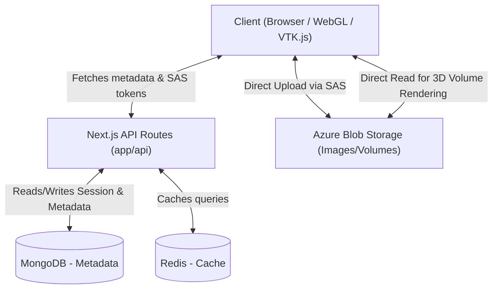

# CryoVizWeb

CryoVizWeb is a comprehensive, web-based 3D medical imaging visualization and management platform. It is built to handle the upload, storage, processing, and interactive rendering of complex biological datasets, such as Brightfield and Fluorescent microscopy images, directly in the browser.

## 🚀 What it Does
- **Interactive 3D & 2D Visualization**: View large medical and biological volume datasets natively in the browser using WebGL-based rendering.
- **Dataset Management**: Organizes institutions, users, and imaging datasets. Supports managing mapping/hierarchies of dataset relationships.
- **Role-Based Access Control**: Secure platform with distinct Administrator and User roles. Users only see datasets assigned to them.
- **Cloud Storage & Processing**: Direct-to-Azure Blob Storage uploads using Secure Access Signatures (SAS), followed by asynchronous backend processing pipelines.
- **Annotations & Studies**: Users can create studies, mark annotations, load bulk saved views, and record measurements on datasets.

---

## 🛠️ Technologies Used

### Frontend
- **Framework**: [Next.js 15](https://nextjs.org/) (App Router)
- **UI Library**: [React 19](https://react.dev/), [Tailwind CSS v4](https://tailwindcss.com/), [Radix UI](https://www.radix-ui.com/)
- **3D / Visualization**: 
  - [VTK.js](https://kitware.github.io/vtk-js/) (Volume rendering, multi-planar reconstruction)
  - [React Three Fiber](https://docs.pmnd.rs/react-three-fiber/) & [Three.js](https://threejs.org/) (WebGL scenes)
- **State & Data Fetching**: React Query, Axios
- **Styling & Animations**: Framer Motion, Tailwind Merge, clsx, Lucide React

### Backend
- **Framework**: Next.js 15 API Routes (`app/api`)
- **Database**: [MongoDB](https://www.mongodb.com/) (Metadata, Users, Datasets, Auth Adapter)
- **Caching**: [Redis](https://redis.io/) via `ioredis` (Database query caching)
- **Authentication**: [NextAuth.js v4](https://next-auth.js.org/) with OTP & Magic Links
- **Storage**: [Azure Blob Storage](https://azure.microsoft.com/en-us/products/storage/blobs) (`@azure/storage-blob`)
- **Image Processing**: Sharp, Jimp, image-js, tiff.js

---

## 🏗️ High-Level Design (HLD)

The architecture follows a standard modern decoupled full-stack Next.js paradigm, extended with powerful web-based compute for imaging:



1. **Client Layer (Browser)**:
   - Fetches metadata via Next.js API.
   - For 3D rendering, downloads processed image blobs/chunks directly from Azure Blob Storage to minimize backend bandwidth.
   - Uses WebGL (via VTK.js or React Three Fiber) to reconstruct and volume-render the image arrays using client GPU shaders.
2. **API & Application Layer (Next.js)**:
   - Serves as the secure orchestrator. Validates sessions (NextAuth), checks role permissions.
   - Generates SAS (Shared Access Signature) tokens so the client can upload heavy datasets directly to Azure without passing through the Node.js server.
   - Triggers asynchronous workers for dataset ingestion.
3. **Data & Caching Layer**:
   - `MongoDB` stores all relational metadata (who owns what, annotations, workspace views).
   - `Redis` caches frequently accessed database queries (e.g., fetching all institutions, users, mapping trees) to ensure snappy UI performance.
4. **Storage Layer**:
   - `Azure Blob Storage` holds the heavy volumetric data (TIFFs, PNGs, etc.).

---

## 🧩 Low-Level Design (LLD) & Codebase Structure

### Directory Structure
```text
CryoVizWeb/
├── app/                  # Next.js 15 App Router pages & API endpoints
│   ├── api/              # Backend REST API routes
│   └── (routes)/         # Frontend page definitions (e.g., admin dashboard, viewer)
├── components/           # Reusable React components
│   ├── admin/            # Dashboards, tables, forms for user/dataset management
│   ├── OrthographicViewer/# 2D MPR (Multi-Planar Reconstruction) Viewer components
│   ├── VolumeViewerPng/  # 3D Volume Rendering components
│   ├── sidebar/          # Application navigation layout
│   └── ui/               # Generic UI primitives (Buttons, Dialogs, Sliders - Radix UI)
├── lib/                  # Core backend business logic and utilities
│   ├── models.ts         # MongoDB database schemas and typed data access methods
│   ├── redis.ts          # Redis caching implementation (`getOrSetCache`)
│   ├── mongodb.ts        # MongoDB client initialization
│   ├── auth.ts           # NextAuth configuration & callbacks
│   └── notifications.ts  # System-wide alerting and notification creation
├── hooks/                # Custom React hooks (e.g., `useDashboardData`)
└── public/               # Static assets (images, fonts, icons)
```

### Key Application Flows
1. **Authentication Flow**:
   - User requests OTP -> `api/auth/request-otp` sends email.
   - User submits OTP -> `api/auth/verify-otp` validates against MongoDB.
   - Session relies on NextAuth JWT backed by `@auth/mongodb-adapter`.
2. **Dataset Upload Flow**:
   - Client requests SAS token via `POST /api/upload-to-azure`.
   - Client uploads raw files directly to Azure Blob `TEMP` container.
   - Client pings `POST /api/upload-dataset-async` to notify backend.
   - Backend processes data, updates state via `POST /api/upload-status`, making it available to the viewers.
3. **Viewing Flow**:
   - Authorized user opens dataset. Client fetches blob URLs from MongoDB.
   - `VolumeViewerPng` or `OrthographicViewer` downloads blobs, applies voxel `spacing` (`api/dataset-spacing`), and renders interactive 3D WebGL scenes.

---

## 📡 API Documentation

All endpoints are located in `app/api/...` and expect standard JSON unless explicitly handling FormData.

### Authentication (`/api/auth`)
- `GET/POST [...nextauth]`: Internal NextAuth handlers.
- `POST /request-otp`: Initiates email OTP login.
- `POST /verify-otp`: Verifies token and logs user in.
- `GET /check-user`: Verifies user database existence/status.
- `POST /request-access`: Submits a request for a new user account.

### Administration (`/api/admin`)
- `GET /`: Health check and basic admin role verification.
- `GET /dashboard`: Returns aggregated system metrics (total users, datasets, processing stats).
- `POST /dashboard`: Mutates system state (e.g., `update-system-metrics`, `update-dataset-status`).

### Datasets & Media Integration
- `GET /media?dataset={id}`: Retrieves all physical storage blob URLs associated with a dataset.
- `POST /media`: Registers a newly processed slice/blob to a dataset.
- `DELETE /media?dataset={id}&filename={name}`: Deletes file from Azure and metadata from DB.
- `POST /upload-to-azure`: Generates a short-lived Azure SAS token mapped to a specific `fileName` and `uploadId`.
- `GET/POST /upload-status`: Tracks progress of async dataset processing (0-100%).
- `POST /upload-dataset-async`: Signals backend to start parsing and moving uploaded temp files into permanent storage.
- `GET /dataset-spacing?datasetId={id}`: Returns X, Y, Z tuple for volumetric voxel spacing.

### Organization & Mapping
- `GET/POST/PUT/DELETE /dataset-mappings`: CRUD operations for parent-child dataset hierarchies (used to link related scans or modalities of the same physical sample).
- `GET/POST/PUT/DELETE /studies`: Manages "Studies" (curated workspaces for specific datasets).

### Interactive Annotations
- `GET/POST/PUT/DELETE /annotations`: Saves user-drawn 2D/3D annotations (coordinates, labels) mapped to specific datasets.
- `GET/POST /views`: Retrieves or manages single saved camera/window views.
- `POST /views/load` & `POST /views/bulk`: Efficiently loads or updates arrays of architectural views (syncs what the user is looking at).

### Feedback & Notifications
- `POST /feedback`: Submits user issue or suggestion.
- `GET /feedback/admin`: Retrieves all system feedback.
- `POST /notifications`: Internal tool to ping users (e.g., when their dataset finishes async processing).

---

## 💻 Local Setup & Development

### Prerequisites
- Node.js (v20.x required)
- `pnpm` Package Manager (`npm install -g pnpm`)
- Running MongoDB instance (Local or Atlas)
- Running Redis server

### Environment Variables
Create a `.env.local` file based on `.env.example`:
```env
MONGODB_URI=mongodb+srv://...
NEXTAUTH_SECRET=your_super_secret_string
NEXTAUTH_URL=http://localhost:3000
AZURE_STORAGE_CONNECTION_STRING=DefaultEndpointsProtocol=...
AZURE_TEMP_CONTAINER=temp-uploads
INTERNAL_API_SECRET=backend_service_secret
REDIS_URL=redis://localhost:6379
```

### Running the App
1. **Install dependencies**:
   ```bash
   pnpm install
   ```
2. **Run development server**:
   ```bash
   pnpm dev
   ```
3. **Build for production**:
   ```bash
   pnpm build
   pnpm start
   ```
4. **Run Linter**:
   ```bash
   pnpm lint
   ```
